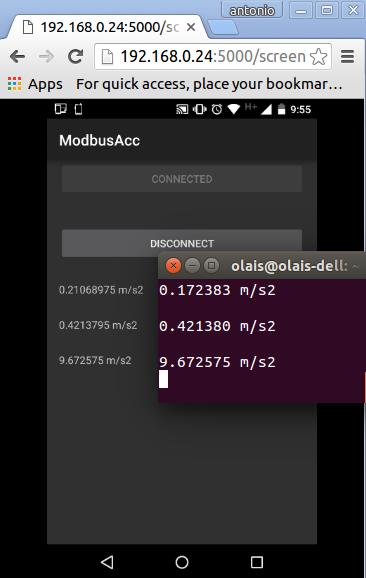

ModbusJNIAcc
=========
ModbusJNIAcc is an example that use an industrial protocol to communicate an android device and a Modbus server.
This example get accelerometer readings and sends them through Modbus/TCP to a Modbus server, the Modbus server prints the values of the three axes of the accelerometer.
 
Screenshots
-----------

LibModbus

ibmodbus is a free software library to send/receive data with a device which respects the Modbus protocol. This library can use a serial port or an Ethernet connection.

https://github.com/stephane/libmodbus
